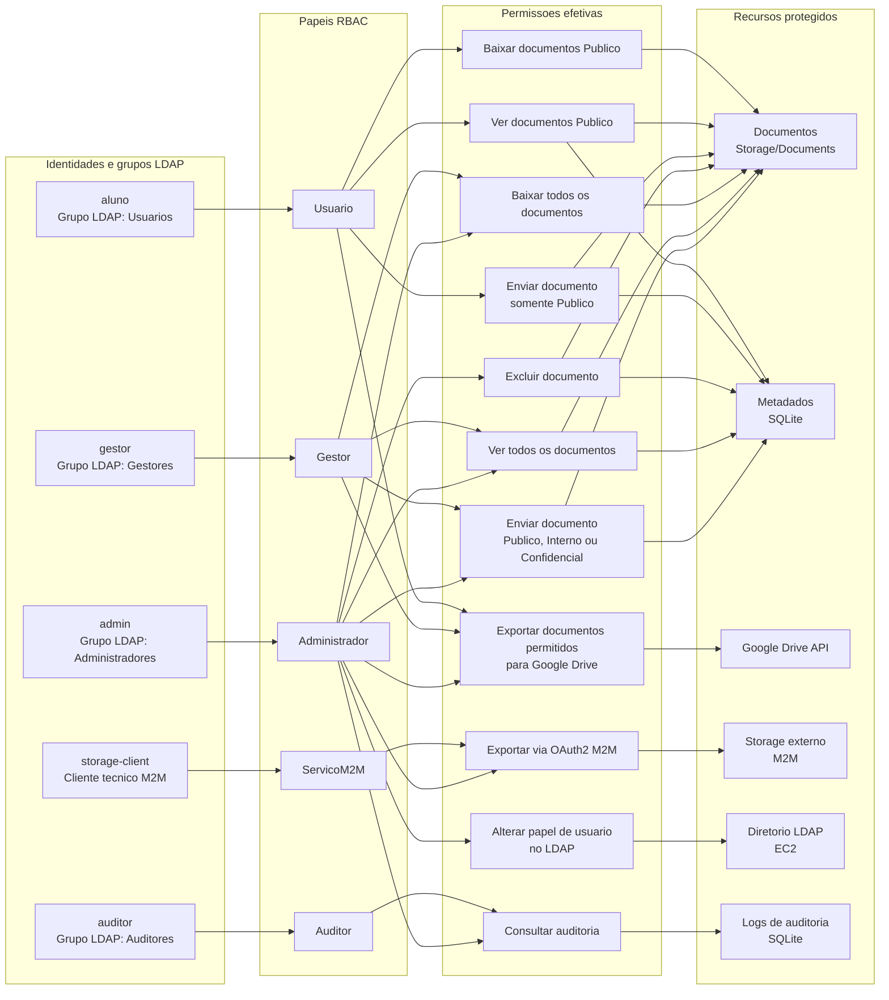

# Diagrama RBAC

Este artefato representa a matriz RBAC da aplicacao. Ele mostra:

- quais identidades existem no LDAP;
- qual papel cada identidade recebe;
- quais permissoes cada papel possui;
- quais recursos cada permissao protege.

## Resumo dos papeis

| Papel | Origem | Recursos | Permissoes principais |
|---|---|---|---|
| Administrador | Grupo LDAP `Administradores` | Documentos, usuarios, auditoria e exportacoes | Controle total |
| Gestor | Grupo LDAP `Gestores` | Documentos e Google Drive | Envia qualquer classificacao, ve/baixa todos, exporta para Drive |
| Usuario | Grupo LDAP `Usuarios` | Documentos publicos e Google Drive | Envia apenas Publico, ve/baixa Publico, exporta Publico para Drive |
| Auditor | Grupo LDAP `Auditores` | Auditoria | Consulta logs sem alterar dados |
| ServicoM2M | `client_id` tecnico | Storage externo | Exporta por OAuth2 Client Credentials |

## Matriz de permissoes

| Permissao efetiva | Administrador | Gestor | Usuario | Auditor | ServicoM2M |
|---|---:|---:|---:|---:|---:|
| Enviar documento Publico | Sim | Sim | Sim | Nao | Nao |
| Enviar documento Interno | Sim | Sim | Nao | Nao | Nao |
| Enviar documento Confidencial | Sim | Sim | Nao | Nao | Nao |
| Ver documentos Publico | Sim | Sim | Sim | Nao | Nao |
| Ver documentos Interno/Confidencial | Sim | Sim | Nao | Nao | Nao |
| Baixar documentos Publico | Sim | Sim | Sim | Nao | Nao |
| Baixar documentos Interno/Confidencial | Sim | Sim | Nao | Nao | Nao |
| Excluir documento | Sim | Nao | Nao | Nao | Nao |
| Exportar para Google Drive | Sim | Sim | Apenas Publico | Nao | Nao |
| Alterar papeis no LDAP | Sim | Nao | Nao | Nao | Nao |
| Consultar auditoria | Sim | Nao | Nao | Sim | Nao |
| Exportar via OAuth2 M2M | Sim | Nao | Nao | Nao | Sim |

## Como explicar na apresentacao

O LDAP autentica o usuario e informa o grupo. A aplicacao converte o grupo LDAP em um papel RBAC. Cada papel possui permissoes especificas, e os controllers validam essas permissoes antes de liberar recursos como documentos, Google Drive, auditoria, LDAP e storage M2M.

Exemplo:

- `aluno` pertence ao grupo LDAP `Usuarios`.
- Esse grupo vira o papel `Usuario`.
- O papel `Usuario` permite apenas documentos `Publico`.
- Mesmo que o aluno tente acessar um documento `Confidencial` pela API, o back-end retorna acesso negado.

## Onde isso esta no codigo

| Parte | Arquivo |
|---|---|
| Nomes dos papeis | `Back/Core/Models/RbacDefinition.cs` |
| Nomes das permissoes | `Back/Core/Models/RbacDefinition.cs` |
| Matriz role -> permissoes | `Back/Core/Services/RbacService.cs` |
| Restricao de classificacao no upload | `Back/Core/Services/RbacService.cs` e `Back/Controllers/DocumentsController.cs` |
| Filtro de visualizacao/download | `Back/Core/Services/RbacService.cs` |
| Tela por permissao | `Back/Controllers/PortalController.cs` |
| Auditoria | `Back/Controllers/AuditController.cs` |
| Troca de papel no LDAP | `Back/Controllers/UsersController.cs` |
