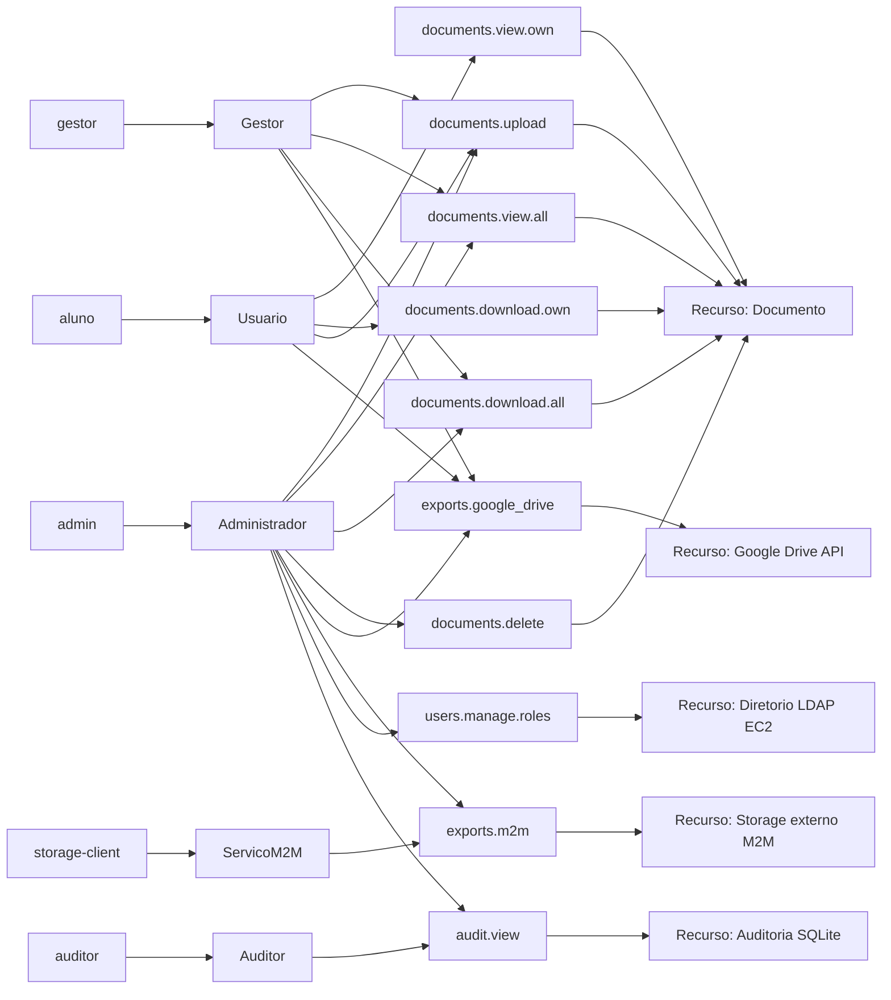

# Diagrama RBAC

## Resumo dos papeis

| Papel | Recursos | Permissoes principais |
|---|---|---|
| Administrador | Documentos, usuarios, auditoria, exportacoes | Controle total e governanca |
| Gestor | Documentos e exportacoes | Ver/baixar todos e exportar para Google Drive |
| Usuario | Proprios documentos | Upload, ver/baixar proprios, exportar para Google Drive |
| Auditor | Auditoria | Consulta logs sem alterar dados |
| ServicoM2M | Storage externo | Exportacao por OAuth2 client credentials |
