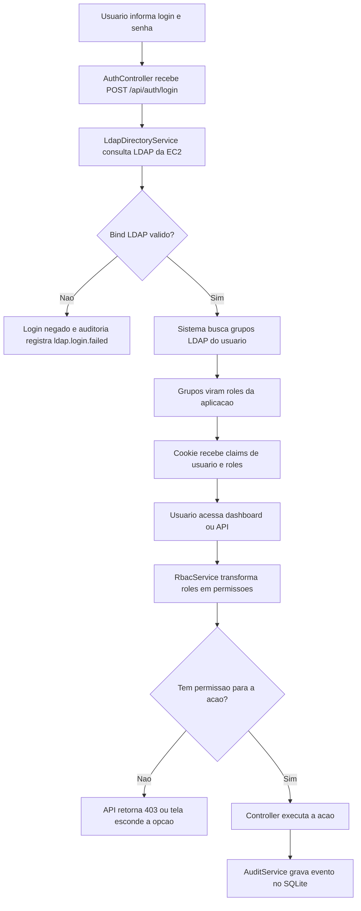
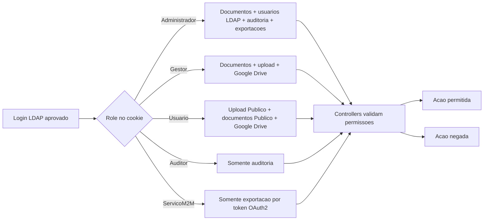

# Fluxograma RBAC

Este fluxograma mostra como a aplicacao decide o que cada usuario pode acessar.

## Decisao por papel

## Matriz de permissoes

| Permissao | Administrador | Gestor | Usuario | Auditor | ServicoM2M |
|---|---:|---:|---:|---:|---:|
| `documents.upload` | Sim | Sim | Sim | Nao | Nao |
| `documents.view.public` | Nao | Nao | Sim | Nao | Nao |
| `documents.view.all` | Sim | Sim | Nao | Nao | Nao |
| `documents.download.public` | Nao | Nao | Sim | Nao | Nao |
| `documents.download.all` | Sim | Sim | Nao | Nao | Nao |
| `documents.delete` | Sim | Nao | Nao | Nao | Nao |
| `exports.google_drive` | Sim | Sim | Sim | Nao | Nao |
| `exports.m2m` | Sim | Nao | Nao | Nao | Sim |
| `users.manage.roles` | Sim | Nao | Nao | Nao | Nao |
| `audit.view` | Sim | Nao | Nao | Sim | Nao |

## Como ler o fluxograma

1. Autenticacao responde: quem e o usuario?
2. LDAP responde: a senha esta correta e quais grupos o usuario possui?
3. RBAC responde: o papel permite essa acao?
4. Controller executa ou nega.
5. Auditoria registra o que aconteceu.

Frase curta para a apresentacao:

> O LDAP autentica e informa os grupos. O RBAC transforma esses grupos em permissoes. Os controllers aplicam essas permissoes antes de executar qualquer acao sensivel.
